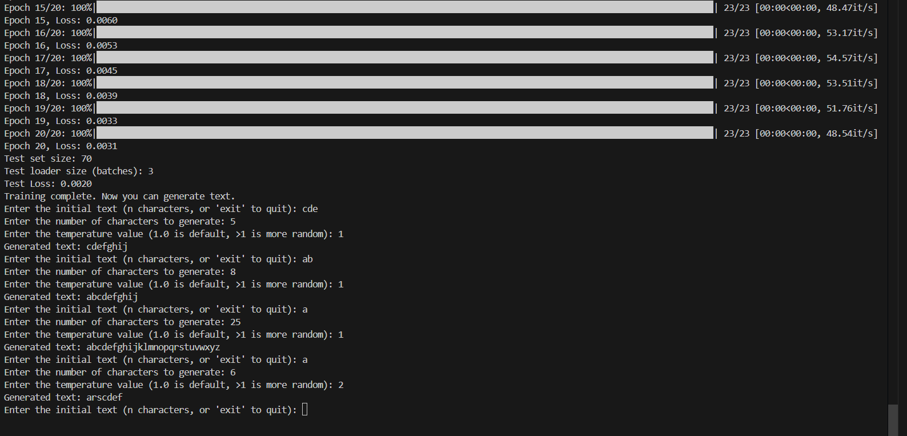
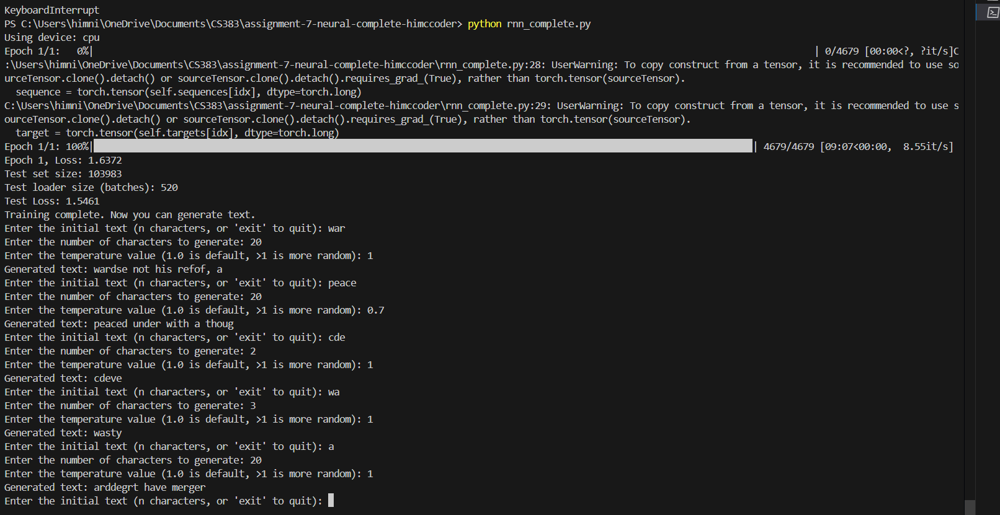

# Neural-Complete

## Himnish's Report Section
This project implements a character-level Recurrent Neural Network (RNN) from scratch using PyTorch. Unlike standard approaches that leverage high-level RNN modules ('nn.RNN', 'nn.LSTM', etc.), this implementation manually defines and trains the core components of an RNN at the tensor level. The goal is to model character sequences in text and learn to predict the next character given a sequence of preceding characters.

By learning patterns at the character level, the model can be used for text generation, such as composing words and sentences in the style of the training corpus.

## 1. Describe your experiments and observations
 #### Dataset: Repeated Alphabet Sequence

For this experiment, the model was trained on a dataset consisting of the sequence `"abcdefghijklmnopqrstuvwxyz"` repeated 100 times. The simplicity and predictability of this dataset made it ideal for validating the fundamental functionality of the RNN.

**Training Results**  
- **Final Train Loss:** 0.0029  
- **Final Test Loss:** 0.0020  

The model converged rapidly, achieving very low loss values. It demonstrated excellent performance on this simple pattern-learning task.

**Generated Text Examples**  
- Input: `"cde"` → Output: `"cdefghij"`  
- Input: `"ab"` → Output: `"abcdefghij"`  
- Input: `"a"` → Output: `"abcdefghijklmnopqrstuvwxz"`  

These examples show that the model successfully learned the sequential structure of the alphabet and could extend sequences with high accuracy.

---

#### Dataset: *War and Peace* (warandpeace.txt)

In this experiment, the model was trained on the text of *War and Peace*, a significantly more complex dataset containing a vast vocabulary and diverse sentence structures.

**Training Results**  
- **Final Train Loss:** 1.6372  
- **Final Test Loss:** 1.5461  

Compared to the alphabet dataset, the loss was considerably higher, which is expected due to the inherent complexity of modeling natural language.

**Generated Text Examples**  
- Input: `"war"` → Output: `"wardse not his refof, a"`  
- Input: `"peace"` → Output: `"peaced under with a thoug"`  

The generated text contained English-like words and fragments but lacked syntactic correctness or coherent semantics.

---

## 2. Analysis on final train and test loss for both datasets

#### Challenges

- **Alphabet Sequence:** The main implementation challenge involved managing the hidden state and resolving tensor shape mismatches.  
- **War and Peace:** The complexity of natural language introduced challenges such as tuning learning rates, managing long-term dependencies, and handling a much larger vocabulary.

#### Insights

- **On Simpler Data:** The alphabet sequence confirmed that RNNs are capable of learning simple, repetitive patterns very efficiently with low training loss.
- **On Complex Data:** Training on *War and Peace* revealed the limitations of basic RNNs in modeling rich natural language. Despite some ability to mimic vocabulary and short word patterns, the model struggled with grammar and sentence structure.
- **On Temperature:** Adjusting the temperature parameter during generation demonstrated its effect on randomness. Lower temperatures led to more deterministic, repetitive outputs, while higher values introduced more variety, albeit at the cost of coherence.

#### Summary Table

| **Dataset**            | **Final Train Loss** | **Final Test Loss** | **Generated Text**                          | **Explanation**                                                                 |
|------------------------|----------------------|----------------------|---------------------------------------------|----------------------------------------------------------------------------------|
| **Alphabet Sequence**  | 0.0029               | 0.0020               | `"cdefghij"`                                | The model achieved near-perfect accuracy due to the simplicity and repetitiveness of the dataset. It can accurately predict the next characters in the sequence. |
| **War and Peace**      | 1.6372               | 1.5461               | `"wardse not his refof, a"`                 | The model learned some patterns, producing English or pseudo-English words. However, the output lacks grammatical structure and coherence due to the complexity of the dataset and limited training time. |

In summary: 
These experiments underscored the importance of both dataset complexity and model architecture in sequence modeling tasks. While RNNs are a strong starting point for learning character-level patterns, more advanced models like LSTMs or Transformers would be better suited for generating coherent, long-form text.

## 3. Explain impact of changing temperature
 #### **Alphabet Sequence Dataset**
- **Temperature = 1.0**  
  The generated output closely follows the deterministic structure of the alphabet. Since the dataset is highly repetitive and predictable, this temperature value results in accurate and expected sequences.

- **Temperature > 1.0**  
  Increasing the temperature introduces some randomness to the output, but the impact is limited due to the simplicity of the data. The model occasionally deviates from the strict alphabet order, though overall structure remains.

- **Temperature < 1.0**  
  Lowering the temperature further reduces variation, leading to extremely deterministic outputs. However, given the nature of the dataset, the difference in output is minimal and largely indistinguishable from the default setting.

#### **War and Peace Dataset**
- **Temperature = 1.0**  
  The model produces text that loosely resembles English, with some coherent words and phrases. While not grammatically correct, the output shows that the model has learned basic linguistic patterns.

- **Temperature > 1.0**  
  Higher temperatures significantly increase randomness. The generated text becomes more chaotic, often breaking word structure and coherence.

- **Temperature < 1.0**  
  Lowering the temperature yields more repetitive and conservative text. The output becomes safer but less interesting, often repeating common word patterns without much novelty or variation.

---

## 4. Reflection

This assignment offered meaningful insight into the strengths and limitations of Recurrent Neural Networks. The alphabet sequence experiment demonstrated how effectively RNNs can learn and predict structured, repetitive patterns with minimal training. In contrast, training on *War and Peace* exposed the challenges of modeling real-world language using simple RNNs. Managing large vocabularies, tuning hyperparameters, and dealing with long-term dependencies proved critical. It also became clear that while RNNs can capture local patterns, more advanced architectures like LSTMs or Transformers are necessary for producing coherent and grammatically correct language over longer sequences. The experience reinforced the importance of thoughtful model design and hyperparameter tuning when scaling to more complex tasks.

### 5. IMPORTANT: Include screenshot of output for generate_text() function: 

 - ### Output after training on sequence: 
 

 - ### Output after training on warandpeace.txt:
 
